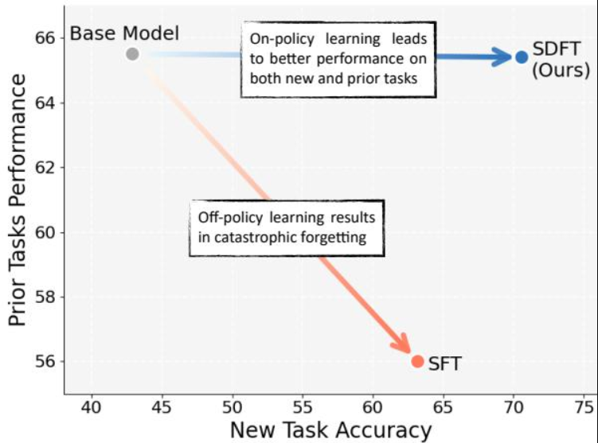
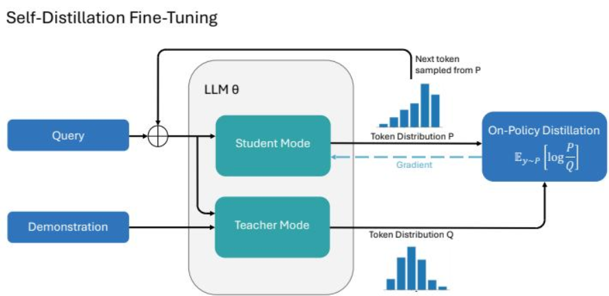
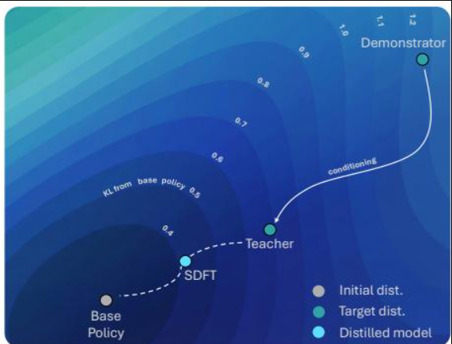
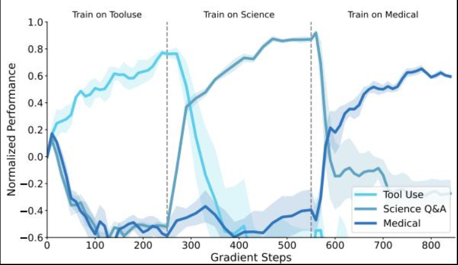
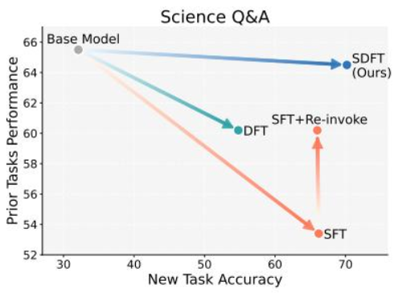
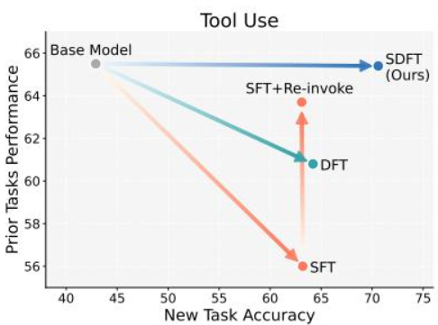
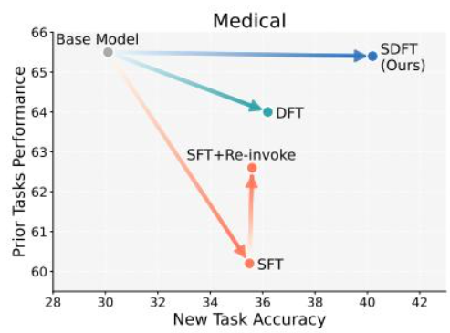
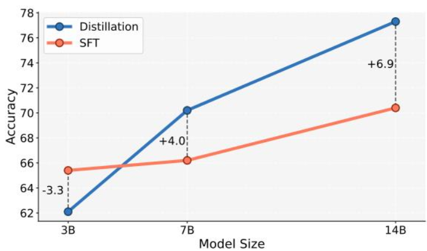
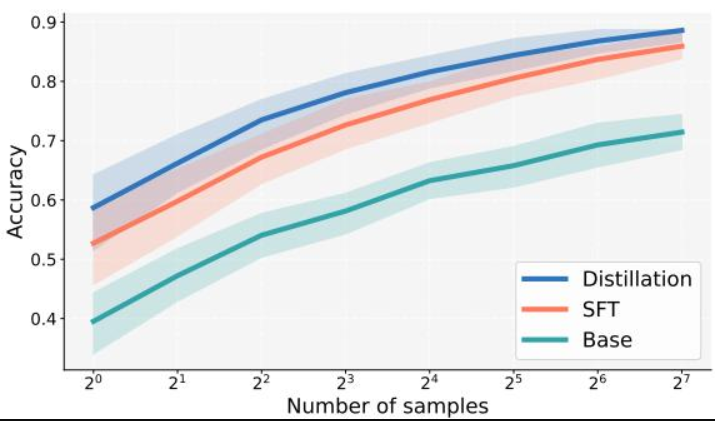
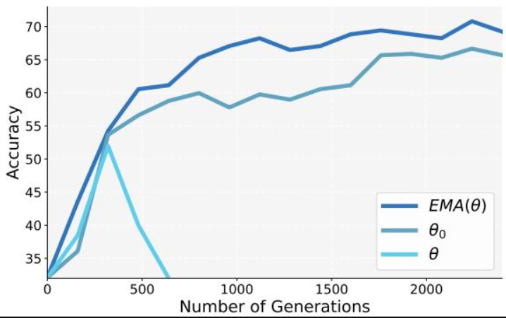

# SELF-DISTILLATION ENABLES CONTINUAL LEARNING

Idan Shenfeld1 2∗ Mehul Damani1 Jonas Hubotter ¨ 3 Pulkit Agrawal1 2 

1MIT 2Improbable AI Lab 3ETH Zurich 

# ABSTRACT

Continual learning, enabling models to acquire new skills and knowledge without degrading existing capabilities, remains a fundamental challenge for foundation models. While on-policy reinforcement learning can reduce forgetting, it requires explicit reward functions that are often unavailable. Learning from expert demonstrations, the primary alternative, is dominated by supervised fine-tuning (SFT), which is inherently offpolicy. We introduce Self-Distillation Fine-Tuning (SDFT), a simple method that enables on-policy learning directly from demonstrations. SDFT leverages in-context learning by using a demonstration-conditioned model as its own teacher, generating on-policy training signals that preserve prior capabilities while acquiring new skills. Across skill learning and knowledge acquisition tasks, SDFT consistently outperforms SFT, achieving higher new-task accuracy while substantially reducing catastrophic forgetting. In sequential learning experiments, SDFT enables a single model to accumulate multiple skills over time without performance regression, establishing on-policy distillation as a practical path to continual learning from demonstrations. Code and Datasets are available at http://idanshenfeld.com/SDFT. 

# 1 INTRODUCTION

Foundation models have achieved remarkable success in recent years, powering AI applications across language, vision, robotics, and beyond. However, despite their impressive capabilities, today’s AI systems remain static after deployment. While they can adapt their behavior at inference time through mechanisms such as retrieval or prompting, they do not update their parameters to acquire new skills, internalize new knowledge, or improve from experience. To enable the next generation of foundation models, we must solve the problem of continual learning: enabling AI systems to keep learning and improving over time, similar to how humans accumulate knowledge and refine skills throughout their lives (Hassabis et al., 2017; De Lange et al., 2021). 

A growing body of recent work has highlighted the importance of on-policy learning for continual learning. When models learn from data generated by their current policy, they exhibit substantially reduced catastrophic forgetting compared to off-policy alternatives (Shenfeld et al., 2025; Chen et al., 2025). To date, most successful on-policy approaches have been developed in the context of reinforcement learning (RL), where feedback is pro-




Figure 1: Supervised Fine-Tuning (SFT) is commonly used to learn from expert demonstration datasets, but its off-policy nature leads to catastrophic forgetting of general capabilities. We introduce Self-Distillation Fine-Tuning (SDFT), which turns expert demonstrations into on-policy learning signals by using a demonstration-conditioned version of the model as its own teacher. In this way, SDFT enables true continual learning with the model improving on new tasks as they arise without regressing existing capabilities.


vided through an explicit reward function. However, in many real-world settings such rewards are unavailable or difficult to specify. Instead, learning typically proceeds from datasets of expert demonstrations. The dominant paradigm in this regime is supervised fine-tuning (SFT), which trains the model to imitate expert 







Figure 2: (Left) SDFT leverages a model’s in-context learning ability to generate on-policy training signals. For each query $x$ , the model acts in two roles. A student that is conditioned only on the query $P = \pi ( \cdot | x )$ and the teacher, which is the same model conditioned on an expert demonstration $c$ , producing a demonstrationaware distribution $Q = \pi ( \cdot | x , c )$ . Training minimizes the reverse KL divergence between the student and teacher, yielding on-policy updates. (Right) Conditioning the model on the expert demonstrations creates a teacher with an output distribution that is substantially closer to the base model, while maintaining the same new-task accuracy.


actions under a fixed, offline data distribution. While simple and scalable, SFT is inherently off-policy, and prior work has shown that sequential SFT can lead to poor generalization and severe catastrophic forgetting when models are adapted to new tasks or domains (Kirkpatrick et al., 2017; Li & Hoiem, 2017). This tension raises a fundamental challenge for continual learning: how can we obtain the benefits of on-policy learning when only demonstrations are available? 

The challenges of off-policy learning can, in principle, be overcome by first learning a reward function from demonstrations (i.e., Inverse Reinforcement Learning or IRL), and then performing on-policy RL (Ng et al., 2000; Abbeel & Ng, 2004). While IRL is conceptually elegant, effectively recovering rewards typically requires strong priors over the reward structure, which has limited its practical adoption to settings where such assumptions are justified, such as RLHF (Peng et al., 2018; Stiennon et al., 2020). 

Rather than inferring an explicit reward function, we propose Self-Distillation Fine-Tuning (SDFT), an onpolicy distillation (Ross et al., 2011; Agarwal et al., 2024) framework for learning directly from demonstrations. SDFT relies on the observation that large pretrained models exhibit strong in-context learning—the ability to adapt their behavior when conditioned on examples, without parameter updates (Brown et al., 2020). We exploit this property by using the same model in two roles: a teacher, conditioned on both the task input and an expert demonstration, and a student, conditioned only on the task input. Training distills the teacher’s predictions into the student on trajectories generated by the student itself, yielding on-policy updates that incorporate information from demonstrations without explicit reward inference or offline imitation. 

We evaluate SDFT in two continual learning settings: skill learning, where demonstrations are used to improve performance on a task, and knowledge acquisition, where new information must be incorporated into the model. Across both settings, SDFT provides stable on-policy updates that enable learning while substantially reducing catastrophic forgetting compared to supervised learning. Consistent with prior work on onpolicy learning (Ross et al., 2011; Chu et al., 2025), SDFT also improves generalization both in-distribution and out-of-distribution, making it beneficial even in settings where retaining prior capabilities is not the primary objective. In a sequential learning experiment involving three distinct skills, SDFT enables a single model to acquire each skill in turn while preserving performance on previously learned skills as well as on unrelated, pre-existing capabilities — demonstrating that continual learning from demonstrations is possible. 

# 2 RELATED WORK

Off-policy versus On-policy Learning. A long line of work highlights the advantages of on-policy learning, i.e., training on trajectories induced by the model itself, over off-policy learning. The seminal result of Ross et al. (2011) shows that off-policy imitation learning suffers from compounding errors at inference time, as the learned policy drifts away from the states covered in the demonstrations, errors accumulate rapidly, a failure mode that on-policy algorithms avoid by continually training under their own state distribution. More 

recent empirical studies reinforce this distinction. Models fine-tuned with on-policy RL have been shown to generalize better beyond the training distribution (Agarwal et al., 2024; Han et al., 2025; Chu et al., 2025; Li et al., 2025) and transfer more effectively to related tasks (Huan et al., 2025) than models trained purely offpolicy. In continual learning settings, on-policy updates also reduce catastrophic forgetting when adapting to new tasks (Shenfeld et al., 2025; Lai et al., 2025). These findings collectively motivate our goal - to enable on-policy learning from demonstrations, thereby retaining the benefits of on-policy RL while avoiding the need for explicit reward engineering. 

Inverse Reinforcement Learning. IRL $\mathrm { N g }$ et al., 2000) provides a classical solution to the problem faced in many RL settings: the agent must learn a policy when no explicit reward function is available, only demonstrations. Rather than cloning the expert’s actions, IRL seeks to infer the underlying reward for which those demonstrations would be optimal. This perspective avoids the issues of off-policy imitation learning, since the inferred reward can support on-policy updates (Xu et al., 2020). While this idea has deep theoretical appeal, traditional IRL methods are known not to scale well (Lazzati et al., 2024; Arora & Doshi, 2021). 

A common thread across all successful IRL formulations is that they rely on strong structural assumptions to make the reward identifiable. Maximum-entropy IRL assumes that experts follow a soft-optimal Boltzmann policy (Ziebart et al., 2008; Wulfmeier et al., 2015); adversarial IRL methods (Ho & Ermon, 2016) assume that expert and learner trajectories can be distinguished by a classifier; and preference-based IRL methods, such as RLHF (Ziegler et al., 2019; Ouyang et al., 2022), assume access to pairs of positive–negative demonstrations. These priors are essential—without them, IRL is either ill-posed or too expensive to be practical. In our approach, rather than imposing an explicit learning reward function, we leverage the model’s in-context learning to extract an on-policy learning signal. 

Context Distillation. Our method also relates to the growing line of work on context distillation, in which a model conditioned on additional information acts as a teacher for a version of itself without that information (Bai et al., 2022; Snell et al., 2022). Prior approaches typically rely on offline distillation from static contexts, such as few-shot examples or behavioral guidelines, and supervise the student on trajectories drawn from the teacher’s distribution. Our algorithm differs in two important ways. First, the distillation is on-policy: the student is trained under its own induced trajectory distribution, allowing the teacher to correct errors as they arise (Ross et al., 2011; Agarwal et al., 2024). Second, the context provided to the teacher is not a fixed prompt prefix but a specific demonstration chosen for each query. This dynamic, instance-wise conditioning enables the teacher to express fine-grained task intent, rather than a single global behavioral prior. Together, these differences allow context distillation to function not merely as a form of prompt compression but as an IRL-like mechanism that extracts and transfers the underlying reasoning induced by demonstrations. 

# 3 SELF-DISTILLATION FINE-TUNING

Our approach builds on the framework of student-teacher distillation, where a student model is trained to match the behavior of a teacher model by minimizing the divergence between their output distributions. Traditionally, distillation uses separate models, typically a larger, more capable teacher and a smaller student (Hinton et al., 2015). Our key innovation is that we can use the same model as both teacher and student by exploiting its in-context learning abilities. Specifically, given a foundation model with policy $\pi$ , we construct the teacher by conditioning it on expert demonstrations: $\pi ( \cdot | x , c )$ , where $x$ is the task prompt and $c$ is a demonstration. The student is simply the base model without this conditioning $\pi _ { \boldsymbol { \theta } } ( \cdot | \boldsymbol { x } )$ . 

To construct the teacher for a given prompt $x$ , we condition the model on both the prompt and a demonstration using the following simple prompt: 

<Question> 

This is an example for a response to the question: 

<Demonstration> 

Now answer with a response of your own, including the thinking process: 

We find that this prompt is sufficient to prevent the policy from outputting $c$ verbatim and instead elicits a response that reflects the model’s understanding of the intent behind the demonstration, leveraging its incontext learning capabilities. See subsection 3.2 for further analysis of the conditioned policy’s outputs. 

As mentioned before, we hypothesize that on-policy learning is necessary for continual learning; therefore, we train the student using on-policy distillation from the teacher. For every prompt $x$ , our algorithm, SDFT, 

samples responses from the student policy $y \sim \pi _ { \theta } ( \cdot | x )$ and minimizes the reverse Kullback-Leibler (KL) divergence between the student and the teacher distributions: 

$$
\mathcal {L} (\theta) = D _ {K L} \left(\pi_ {\theta} (\cdot | x) \| \pi (\cdot | x, c)\right) = \mathbb {E} _ {y \sim \pi_ {\theta} (y | x)} \left[ \log \frac {\pi_ {\theta} (y | x)}{\pi (y | x , c)} \right] \tag {1}
$$

Leveraging the autoregressive nature of the model, we decompose this objective into a token-level loss (see Tang & Munos (2025) for a derivation) and take the gradient with respect to the student parameters $\theta$ while treating the teacher distribution as fixed. This results in the following gradient estimator: 

$$
\nabla_ {\theta} \mathcal {L} (\theta) = \mathbb {E} _ {y \sim \pi_ {\theta}} \left[ \sum_ {t} \sum_ {y _ {t} \in \mathcal {V}} \log \frac {\pi_ {\theta} \left(y _ {t} \mid y _ {<   t} , x\right)}{\pi \left(y _ {t} \mid y _ {<   t} , x , c\right)} \nabla_ {\theta} \log \pi_ {\theta} \left(y _ {t} \mid y _ {<   t}, x\right) \right] \tag {2}
$$

where $\nu$ is the token vocabulary. A critical component of SDFT is the parameterization of the teacher model used to compute the likelihood ratios. While the teacher is always conditioned on the demonstrations $c$ , its weights can be defined in multiple ways. Subsection 4.6 includes an ablation regarding this design choice, but unless mentioned otherwise, we use an exponential moving average (EMA) of the student parameters for the teacher. A full detailed description of our algorithm can be found in Algorithm 1 in the appendix. 

# 3.1 SELF-DISTILLATION AS INVERSE RL

Although we present our algorithm from a student-teacher distillation perspective, it can also be interpreted in the IRL framework, where it maximizes an implicit reward function. In the following section, we formally show that our self-distillation objective is mathematically equivalent to maximizing an implicit reward function defined by the expert demonstrations and the model’s in-context learning capabilities. 

We begin with the standard formulation of trust-region-regularized reinforcement learning Schulman et al. (2015), where the policy update in step $k + 1$ is constrained to stay close to the current policy $\pi _ { k }$ : 

$$
\pi_ {k + 1} = \max  _ {\pi} \mathbb {E} _ {y \sim \pi} [ r (y, x) ] - \beta D _ {\mathrm {K L}} (\pi (\cdot | x) \| \pi_ {k} (\cdot | x)) \tag {3}
$$

For this objective, the optimal policy $\pi _ { k + 1 } ^ { * }$ takes the known closed-form expression of a tilted distribution (Korbak et al., 2022; Rafailov et al., 2023): 

$$
\pi_ {k + 1} ^ {*} (y | x) \propto \pi_ {k} (y | x) \exp (\frac {1}{\beta} r (y, x))
$$

Rearranging this equation allows us to express the underlying reward as a function of the divergence between the optimal and previous policies: 

$$
r (y, x) = \beta \left[ \log \pi_ {k + 1} ^ {*} (y | x) - \log \pi_ {k} (y | x) \right] + C
$$

In a standard IRL setting, $\pi _ { k + 1 } ^ { * }$ is unknown. However, our key idea is that the model’s own in-context learning capabilities provide a robust approximation of this optimal policy. We introduce our In-Context Assumption - given a demonstration $c$ , the model conditioned on $c$ approximates the optimal next policy. 

$$
\pi_ {k + 1} ^ {*} (y | x) \approx \pi (y | x, c) \tag {4}
$$

This substitution posits that the behavioral shift induced by observing a demonstration reflects the expert’s true intent. Substituting this into Eq. (6), we derive an intrinsic reward function: 

$$
r (y, x, c) = \log \pi (y | x, c) - \log \pi_ {k} (y | x) \tag {5}
$$

We drop $\beta$ and $C$ since linear transformations of reward do not affect the optimal policy (Sutton et al., 1998). While this defines a trajectory-level reward, our model has an autoregressive structure. Therefore, we decompose the reward into token-level rewards $r _ { t }$ via token-level probabilities. We define the instantaneous reward as the immediate log-probability change: 

$$
r _ {t} (y _ {t} \mid y _ {<   t}, x, c) = \log \frac {\pi (y _ {t} \mid y _ {<   t} , x , c)}{\pi_ {k} (y _ {t} \mid y _ {<   t} , x)},
$$

and indeed for all $y$ , we have $\begin{array} { r } { \sum _ { t } r _ { t } ( y _ { t } | y _ { < t } , x , c ) = r ( y , x , c ) } \end{array}$ . Finally, we demonstrate that optimizing the policy with respect to this reward is equivalent to the reverse-KL distillation used in our method. The policy gradient under the current policy $\pi _ { k }$ is: 

$$
\nabla_ {\theta} J (\pi_ {k}) = \mathbb {E} _ {y \sim \pi_ {k}} \left[ r (y, x, c) \nabla_ {\theta} \log \pi_ {k} (y | x) \right]
$$


(a) SDFT





(b) SFT


Figure 3: In a challenging continual learning experiment, where one model is trained sequentially on three different tasks, SDFT is able to learn each one while retaining performance on the others. In contrast, SFT performance on each task drops once it starts learning the next one. Performance is linearly normalized such that 0 corresponds to the base model accuracy on each one of the tasks, and 1 to the maximum accuracy obtained across both algorithms.


Substituting our derived reward from Equation 5: 

$$
\nabla_ {\theta} J \left(\pi_ {k}\right) = \mathbb {E} _ {y \sim \pi_ {k}} \left[ \log \frac {\pi (y \mid x , c)}{\pi_ {k} (y \mid x)} \nabla_ {\theta} \log \pi_ {k} (y \mid x) \right] \tag {6}
$$

We observe that this is equivalent in expectation to the gradient of the reverse KL divergence $D _ { \mathrm { K L } } ( \pi _ { k } ( \cdot | x ) | | \pi ( \cdot | x , c ) )$ in Equation 2. Thus, our method can be viewed as an on-policy RL algorithm that maximizes rewards inferred by comparing the student’s current behavior to its own “wiser,” demonstrationaware counterpart. 

# 3.2 VALIDATING THE ICL ASSUMPTION

The core hypothesis of SDFT can be seen as the assumption in Equation 4, which states that a model conditioned on an expert demonstration behaves like the (unknown) optimal policy for that task $\pi _ { k + 1 } ^ { * } ( y | x ) \approx$ $\pi ( \boldsymbol { y } | \boldsymbol { x } , \boldsymbol { c } )$ and therefore it can be a good teacher. The quality of this approximation depends on 2 conditions: 

1. Optimality: The teacher’s expected reward must match that of the unknown optimal policy: 

$$
\mathbb {E} _ {y \sim \pi (y | x, c)} [ r (y, x) ] \approx \mathbb {E} _ {y \sim \pi_ {k + 1} ^ {*}} [ r (y, x) ]
$$

In other words, samples drawn from the demonstration-conditioned policy should achieve near-maximal reward on the task. 

2. Minimal Deviation: Due to the trust-region regularization in Equation 3, the optimal policy $\pi _ { k + 1 } ^ { * } ( y | x )$ is the one closest to the current model among all the ones that maximize reward. Thus, we require: 

$$
D _ {\mathrm {K L}} \left(\pi (\cdot | x, c) | | \pi_ {k} (\cdot | x)\right) \approx D _ {\mathrm {K L}} \left(\pi_ {k + 1} ^ {*} (\cdot | x) | | \pi_ {k} (\cdot | x)\right)
$$

That is, among all policies that achieve optimal reward, the teacher should be close, in the KL sense, to the $\pi _ { k }$ . 

The second requirement, remaining close to the current policy, is crucial for practical viability. If the demonstration-conditioned teacher simply mimicked the example verbatim, it would deviate substantially from the base model, losing the benefits of on-policy learning. What makes the teacher valuable is that it produces new, task-appropriate behavior while remaining anchored to the base model. Moreover, prior work shows that distributions close to the pretrained distribution suffer significantly less catastrophic forgetting and better preserve general capabilities (Shenfeld et al., 2025; Chen et al., 2025). 

Empirical Validation. While we cannot verify these conditions theoretically, we evaluate each empirically. We use the Qwen-2.5-7B-Instruct model (Hui et al., 2024) as the base policy and the ToolAlpaca dataset (Tang et al., 2023). In this benchmark, the model receives a tool-API specification and a user request, and must identify the correct tool call. Without demonstrations, the base model solves only $42 \%$ of 

examples. When provided with the appropriate demonstration $c$ for each prompt $x$ , the teacher achieves a $100 \%$ success rate. To further test reward proximity, we manually inspected 50 teacher reasoning traces. In all cases, not only were the final tool calls correct, but the intermediate chain-of-thought was valid and semantically grounded. This suggests that the teacher is reconstructing a correct reasoning process rather than merely copying the expert output. These observations provide evidence for the first requirement, that the demonstration-conditioned model behaves as an optimal policy. 

To verify the second requirement, we measure the KL divergence to the base policy $D _ { \mathrm { K L } } ( \pi \Vert \pi _ { 0 } )$ as a proxy for the distance to the policy during training $\pi _ { k }$ . We compare this divergence for both the SFT model trained on demonstrations and the demonstration-conditioned teacher. As shown in Figure 2 (right panel), the SFT model deviates substantially from the base model (1.26 nats), whereas the teacher remains significantly closer (0.68 nats)—nearly half the divergence. This validates that the teacher produces high-quality outputs while maintaining proximity to the base policy, precisely the balance required by the trust-region formulation. 

# 4 EXPERIMENTS

# 4.1 EXPERIMENTAL SETTING

We evaluate our method in two settings that reflect common forms of post-training adaptation: Skill Learning and Knowledge Acquisition. These correspond to improving performance on a new task, and integrating novel factual information into a pretrained model. 

In Skill Learning, we study whether a pretrained LLM with broad capabilities can acquire a new, narrowly defined skill without degrading its existing abilities. We choose to experiment with tasks the models had not been explicitly fine-tuned on (unlike Math or Coding) to show the benefits of continual learning. Therefore, we test our method on three domains: 

• Science Q&A: Undergraduate-level scientific reasoning, using the Chemistry L-3 subset of SciKnowEval (Feng et al., 2024). 

• Tool Use: Mapping a tool-API specification and user request to the correct tool call, using ToolAlpaca (Tang et al., 2023). 

• Medical: Clinical reasoning questions, with training data from stage 1 of the HuatuoGPT-o1 pipeline and evaluation from stage 2 (Chen et al., 2024). 

In Knowledge Acquisition, the objective is different: the model must integrate genuinely new factual content not present in its pretraining data. We construct a corpus of Wikipedia articles describing natural disasters that occurred in 2025 (after the training knowledge cutoff), totaling approximately 200K tokens. Following Mecklenburg et al. (2024), we generate question–answer pairs about these articles, yielding an SFT dataset roughly $5 \times$ larger than the source corpus. These questions probe factual content such as “which regions were affected by the 2025 Myanmar earthquake?”. 

This setting tests whether the model can absorb newly injected knowledge rather than merely improving skills it already has. 

Evaluation. For each task, we evaluate along two primary axes: 

• In-Distribution Accuracy: Accuracy on held-out test data for the newly introduced task. For Knowledge Acquisition, we use two variants: (1) All details correct (Strict Accuracy). (2) The answer contains correct information and no incorrect statements (Lenient Accuracy). 

• Previous Capabilities: Performance on a suite of established benchmarks that probe general reasoning and world knowledge: HellaSwag (Zellers et al., 2019), TruthfulQA (Lin et al., 2021), MMLU (Hendrycks et al., 2020), IFEval (Zhou et al., 2023), Winogrande (Sakaguchi et al., 2021), and HumanEval (Chen et al., 2021). We report the average performance across these datasets as a measure of catastrophic forgetting. 

For the Knowledge Acquisition setting, we include a third metric: 

• Out-of-Distribution Accuracy: “Indirect” questions whose answers depend on the injected knowledge but do not directly reference it (e.g., “Which countries required international humanitarian aid in 2025?”). This measures whether the new information has been properly integrated into the model’s internal memory rather than memorized in a narrow form. 










Figure 4: Performance trade-offs between new task accuracy and retention of prior capabilities. Each point represents a trained model, with the top-right indicating ideal performance (high accuracy on both new and previous tasks). SDFT consistently achieves superior Pareto efficiency compared to baselines across all three skill learning tasks.


Baselines. In the Skill Learning setting, we compare our method to standard SFT and to DFT (Wu et al., 2025b), which uses importance sampling to treat the offline dataset as on-policy samples. We also include the recently proposed ”Re-invocation” method (Lu & Lab, 2025), which performs additional on-policy distillation from the base policy on general-purpose prompts after SFT to restore prior capabilities. 

In the Knowledge Acquisition setting, we compare our method to CPT (Continual Pre-Training), which trains directly on the text corpus using next token prediction loss and SFT, which trains on the question-answer pairs. In addition, we also compare with pure ICL methods. Because the full corpus exceeds the model’s context window, we evaluate RAG with an oracle retriever that always provides the correct article for each question. 

Unless otherwise noted, all experiments were performed on the Qwen2.5-7B-Instruct model. For each baseline, we perform a hyperparameter sweep and report results for the model achieving the highest validation performance on the target task. Full datasets, hyperparameters, and training protocols are provided in Appendix B. 

# 4.2 ON-POLICY LEARNING LEADS TO BETTER GENERALIZATION

Prior work has shown that on policy learning achieves better in-distribution performance than SFT (Ross et al., 2011), as well as superior out-of-distribution generalization (Chu et al., 2025). We investigate whether these advantages also arise in our on-policy distillation framework. For that, we measure performance on test set on all our training tasks, as well as OOD generalization in the Knowledge Acquisition setting. 

Results. Results for Skill Learning, as shown in Figure 4, indicate that our method achieves higher new-task accuracy than SFT, which represents better in-distribution generalization. We attribute these gains to the fact that off-policy learning trains only on expert-induced trajectories; errors at test-time can push the policy into unseen states, causing compounding errors. On-policy imitation learning avoids this mismatch by training on the state distribution induced by the learned policy itself (Ross et al., 2011). 

The results for Knowledge Acquisition appear in Table 1. Since the new knowledge was not included in the base model’s training, it cannot answer any of the questions correctly. Consistent with earlier observations (Mecklenburg et al., 2024), continual pretraining performs poorly. SFT on questions improves performance substantially but still lags behind our SDFT. On strict accuracy, it reaches $80 \%$ while our on-policy method achieves $89 \%$ and nearly closes the gap to the oracle RAG model. The advantage becomes even clearer on out-of-distribution questions, where our method achieves close to perfect accuracy, while SFT’s performance remains low. This disparity underscores a key limitation of SFT: it teaches the model to reproduce specific answers but does not reliably 

<table><tr><td></td><td>Accuracy (strict)</td><td>Accuracy (lenient)</td><td>OOD Accuracy</td></tr><tr><td>Base</td><td>0</td><td>0</td><td>0</td></tr><tr><td>Oracle RAG</td><td>91</td><td>100</td><td>100</td></tr><tr><td>CPT</td><td>9</td><td>37</td><td>7</td></tr><tr><td>SFT</td><td>80</td><td>95</td><td>80</td></tr><tr><td>SDFT (Ours)</td><td>89</td><td>100</td><td>98</td></tr></table>


Table 1: SDFT effectively integrates new factual knowledge, thus achieving better accuracy both in- and out-of-distribution.








Figure 5: (Left) SDFT benefits from model scale. Performance gap between SDFT and SFT on the Science Q&A task increases with model size, as larger models have stronger in-context learning capabilities. (Right) SDFT improves pass $@ \mathbf { k }$ across various k, indicating genuine skill acquisition rather than entropy collapse.


incorporate the underlying facts into the model’s broader knowledge base. 

Finally, with on-policy RL there is a concern for superficial improvements through entropy reduction rather than acquisition of new behaviors (Yue et al., 2025; Wu et al., 2025a). To ensure our gains are not merely due to distributional sharpening, we evaluate pass $@ k$ for $k$ up to 128 in the Skill Learning Setting. As shown in Figure 5 (right), the performance gains over both the base model and SFT persist uniformly across all $k$ . This indicates that the improvements reflect genuine skill acquisition rather than entropy collapse. 

# 4.3 LEARNING WITHOUT FORGETTING

A central claim of SDFT is that, due to its on-policy nature, it can acquire new skills while mitigating catastrophic forgetting. To test this, we perform the following experiments: 

1. Single Task Learning. A convenient case study for continual learning is fine-tuning a model on a single task. Using the Skill Learning setting, we compare the broad capabilities of our models before and after training on each task. 

2. Multi-Task Continual Learning. We investigate a more complex continual learning experiment in which a single model is trained sequentially on each task. The goal here is to measure catastrophic forgetting over longer training and to see whether the model retains the capabilities it learned at each stage of training. 

.Results. The results for single-task training, presented in Figure 4, show that our method is the only approach to improve performance on the new task without significant degradation in prior capabilities. In contrast, standard SFT produces substantial catastrophic forgetting across all evaluated benchmarks. Augmenting SFT with the “re-invoke” procedure partially restores lost abilities but does not recover the base model’s full capabilities. DFT, which performs approximate on-policy updates, exhibits reduced forgetting relative to SFT but still results in noticeable degradation. For the breakdown of the score over prior tasks, see Table 5. 

We now turn to the more challenging setting of long-horizon continual learning, where a single model is trained sequentially on all three skills. Figure 3 shows that SDFT enables stable accumulation of skills over time. As training progresses, the model improves on each newly introduced task while maintaining performance on previously learned ones. In contrast, SFT exhibits severe interference—performance on earlier skills rapidly degrades once training shifts to a new task, resulting in oscillatory behavior rather than cumulative learning. These results demonstrate that SDFT supports true continual learning, allowing a single model to incrementally acquire multiple skills without catastrophic forgetting. 

# 4.4 EFFECT OF MODEL SIZE

Our method relies fundamentally on the model’s in-context learning ability. The teacher signal comes from the model conditioned on demonstrations, and the quality of that signal depends on how well the model can interpret and extrapolate from those examples. This suggests that larger models, whose in-context learning 

abilities are known to improve with scale (Brown et al., 2020), should yield stronger teacher policies and therefore better SDFT updates. To test this hypothesis, we conduct a scaling experiment using several sizes from the Qwen 2.5 family (Hui et al., 2024), evaluating each on the Science Q&A task. 

Figure 5 (left) illustrates a clear trend. At small scales, such as the 3B variant, the model’s in-context learning is too weak to provide meaningful teacher guidance, and performance lags behind standard SFT. However, as we increase the size, the gains from our method grow consistently. The 7B model achieves a four-point improvement over SFT, and the 14B model widens the margin to seven points. This monotonic improvement suggests that the effectiveness of our algorithm is tightly coupled to the model’s ability to perform in-context reasoning, and, as larger models continue to exhibit stronger ICL behavior, our approach is likely to become even more advantageous at larger scales. 

# 4.5 TRAINING REASONING MODELS WITHOUT REASONING DATA

A major practical challenge in post-training reasoning models is the construction of high-quality supervision. Supervised fine-tuning for reasoning models typically requires access to intermediate reasoning traces, which are expensive to collect from human annotators and often unavailable from closed-source models that expose only final answers. As a result, many real-world datasets provide only the final answer, without the full chain of thought. 

Naively applying SFT on such data can be harmful for reasoning-capable models. Because SFT directly matches the target responses, when demonstrations contain only short answers or abbreviated reasoning, this suppresses the model’s existing long chain-of-thought behavior. For example, consider a model that reliably produces long chains of thought, but is post-trained using demonstrations that provide only concise solutions. Direct SFT penalizes long reasoning traces in favor of short outputs that better match the supervision, causing a collapse in reasoning depth. We hypothesize that our on-policy self-distillation framework avoids this failure mode. Because the student policy is trained to match the outputs of a demonstration-conditioned teacher derived from the same model, the supervision preserves the model’s internal reasoning style even when the external data contains only final answers. In effect, the teacher induces a reasoning-consistent target distribution, allowing the model to adapt without collapsing its reasoning behavior. 

We evaluate this hypothesis using Olmo-3-7B-Think (Olmo et al., 2025) and fine-tune it on the medical task described earlier. Importantly, this dataset contains no explicit chain-of-thought annotations. We compare standard SFT against our method, measuring both task accuracy and the average number of generated tokens, which serves as a proxy for retained reasoning depth. 

Results. Table 2 presents the results. Standard SFT substantially degrades performance, reducing accuracy from $3 1 . 2 \%$ to $2 3 . 5 \%$ and sharply shortening responses, indicating a collapse in reasoning 

<table><tr><td></td><td>Accuracy</td><td>Avg. # of tokens</td></tr><tr><td>Olmo-3-7B-Think</td><td>31.2</td><td>4612</td></tr><tr><td>+ SFT</td><td>23.5</td><td>3273</td></tr><tr><td>+ SDFT (Ours)</td><td>43.7</td><td>4180</td></tr></table>

Table 2: Training reasoning models with answer-only supervision. SFT degrades both task performance and general reasoning behavior (indicated by shortened responses). SDFT avoids this collapse by learning from a demonstration-conditioned teacher rather directly from the demonstrations. 

behavior. In contrast, our method significantly improves accuracy, reaching $4 3 . 7 \%$ . These results demonstrate that our approach enables effective task adaptation for reasoning models even in the absence of explicit reasoning data. 

# 4.6 WHAT DRIVES THE IMPROVEMENT IN PERFORMANCE?

Our method combines two ingredients: a demonstration-conditioned teacher policy and an on-policy distillation objective. In Subsection 3.2, we validated that the conditioned model constitutes a high-quality teacher—producing correct outputs while remaining close to the base policy. A natural question then arises: if such a teacher already exists, is on-policy learning necessary, or would standard distillation suffice? 

To isolate the source of the performance gains, we compare our full algorithm against two alternative ways of leveraging the same teacher: (1) SFT from the teacher, where the student is trained offline to imitate samples generated by the teacher. (2) Offline distillation from the teacher, where the student minimizes a KL loss on a fixed dataset of teacher-generated outputs (Mitra & Ulukus, 2025). We use the Tool Use task for the comparison. 

Results. As shown in Figure 6, neither form of offline distillation matches the performance of our onpolicy approach. While distillation from the teacher improves over standard SFT, it consistently underperforms our method. This gap indicates that the benefits of SDFT cannot be attributed solely to the quality of the teacher and further highlights the importance of on-policy learning. 

# 5 DISCUSSION AND LIMITATIONS

Relationship to on-policy RL. SDFT is not an alternative to on-policy RL, but addresses a complementary learning regime. The two methods operate under different supervision assumptions: SDFT applies when learning from expert demonstrations without access to an explicit reward function, whereas on-policy RL assumes a reward signal and optimizes expected return through exploration. 


Figure 6: On-policy learning is essential for performance gains. While offline distillation from the improves over standard SFT, it consistently underperforms on-policy SDFT, demonstrating that the benefits cannot be attributed solely to teacher quality.


Importantly, the two approaches can be naturally combined. As shown in Figure 5, SDFT consistently improves pass $@ k$ across a wide range of $k$ , indicating that it increases the diversity and quality of highprobability generations. This suggests that SDFT can serve as an effective initialization for subsequent RL fine-tuning, providing a stronger starting policy. 

If one nevertheless compares the training dynamics, a practical advantage of SDFT is its efficiency. Our method requires only a single on-policy generation per prompt, whereas many on-policy RL methods, such as GRPO, rely on group-based sampling to estimate relative advantages, substantially increasing generation cost. Moreover, our supervision is provided at the token level (or even the logit level), providing denser credit assignment than the trajectory-level advantage used in GRPO. 

Computational Costs. A practical consideration when adopting SDFT is that, unlike standard SFT, it requires generating on-policy rollouts during training. In our experiments, this results in approximately $2 . 5 \times$ the computational cost in FLOPs and roughly $4 \times$ the wall-clock training time compared to SFT. However, this additional cost must be viewed in context: many existing continual learning approaches, such as Re-invoke, require sequential training stages—first performing SFT, then conducting additional on-policy training to restore degraded capabilities. When accounting for this multi-stage process, SDFT can actually reduce total training time while simultaneously achieving better performance on the new tasks. 

Learned Artifacts. A subtle failure mode of our approach is that the student can inherit spurious linguistic patterns from the teacher. Because the teacher is conditioned on demonstrations or text passages, it may produce responses prefaced with phrases like ”Based on the text...” or ”Following the example...” The student, although receiving no such context, sometimes nevertheless reproduces these markers, having learned them as part of the teacher’s output distribution. Empirically, we find that masking the loss over the first few tokens during training effectively suppresses these artifacts without harming downstream accuracy. While this workaround is effective in practice, it is fundamentally a heuristic fix. A more principled solution remains an open problem. 

Requirements for Model Capability. The effectiveness of SDFT depends critically on the base model’s in-context learning capabilities. As demonstrated in our scaling experiments (Figure 4a), smaller models with weak ICL abilities fail to provide meaningful teacher signals. Additionally, the fundamental design of our algorithm imposes constraints on the types of adaptations it can support. SDFT excels at acquiring new skills or knowledge while preserving existing capabilities, but struggles when the desired behavior requires a fundamental shift in the model’s generation patterns. For instance, we found that transforming a nonreasoning model into one that produces explicit chain-of-thought traces proved difficult. Future work should explore modified objectives or prompting techniques to enable more aggressive behavioral changes when necessary. 

Future Work. Several promising directions remain for extending SDFT. First, our method can be naturally combined with on-policy RL, either sequentially by using SDFT as an initialization before reward-based fine-tuning, or simultaneously by blending demonstration-based and reward-based learning signals. Second, although on-policy learning substantially reduces catastrophic forgetting compared to off-policy methods, some degradation of prior capabilities remains. Developing complementary techniques that further minimize forgetting represents an important avenue for future research. Finally, while we focus on expert demonstrations, extending SDFT to learn from non-expert or noisy demonstrations, or from unstructured data such as user conversations, would broaden its applicability to real-world continual learning settings where highquality supervision is scarce. 

# AUTHOR CONTRIBUTIONS

Idan Shenfeld Lead the project and contributed to all aspects of experiments and writing. 

Mehul Damani supported this project, made significant contributions to the design of experiments in discussions and gave valuable advice on presentation and writing. 

Jonas Hubotter ¨ supported this project, made significant contributions to the core algorithmic design, and experimental setting. Gave valuable advice on writing. 

Pulkit Agrawal co-developed the project direction, advised IS, and played a significant role in paper writing. 

# ACKNOWLEDGMENT

We want to express our gratitude to Nitish Dashora, Jyo Pari, Isha Puri, Zhang-Wei Hong, and members of the Improbable AI lab for the helpful discussion on the paper. We also thank Nofit Segal, Dan Haramati, Yael Vinker, and Assaf Ben-Kish for their support. We are grateful to MIT Supercloud and the Lincoln Laboratory Supercomputing Center for providing HPC resources. The research was supported in part by Hyundai Motor Company, Google, and Amazon. The research was sponsored by the Army Research Office and was accomplished under Grant Number W911NF-21-1-0328. The research was also sponsored by the Office of Naval Research and was accomplished under Grant Number N00014-22-1-2740. Research was also sponsored by the Department of the Air Force Artificial Intelligence Accelerator and was accomplished under Cooperative Agreement Number FA8750-19-2-1000. The views and conclusions contained in this document are those of the authors and should not be interpreted as representing the official policies, either expressed or implied, of the Department of the Air Force or the U.S. Government. The U.S. Government is authorized to reproduce and distribute reprints for Government purposes notwithstanding any copyright notation herein. The views and conclusions contained in this document are those of the authors and should not be interpreted as representing the official policies, either expressed or implied, of the Army Research Office, Naval Research Office, Air Force, or the U.S. Government. JH was supported by the Swiss National Science Foundation under NCCR Automation, grant agreement 51NF40 180545. 

# REFERENCES


Pieter Abbeel and Andrew Y Ng. Apprenticeship learning via inverse reinforcement learning. In Proceedings of the twenty-first international conference on Machine learning, pp. 1, 2004. 


Rishabh Agarwal, Nino Vieillard, Yongchao Zhou, Piotr Stanczyk, Sabela Ramos Garea, Matthieu Geist, and Olivier Bachem. On-policy distillation of language models: Learning from self-generated mistakes. In The Twelfth International Conference on Learning Representations, 2024. 


Afra Amini, Tim Vieira, and Ryan Cotterell. Better estimation of the kullback–leibler divergence between language models. In The Thirty-ninth Annual Conference on Neural Information Processing Systems, 2025. 


Saurabh Arora and Prashant Doshi. A survey of inverse reinforcement learning: Challenges, methods and progress. Artificial Intelligence, 297:103500, 2021. 


Yuntao Bai, Saurav Kadavath, Sandipan Kundu, Amanda Askell, Jackson Kernion, Andy Jones, Anna Chen, Anna Goldie, Azalia Mirhoseini, Cameron McKinnon, et al. Constitutional ai: Harmlessness from ai feedback. arXiv preprint arXiv:2212.08073, 2022. 


Tom Brown, Benjamin Mann, Nick Ryder, Melanie Subbiah, Jared D Kaplan, Prafulla Dhariwal, Arvind Neelakantan, Pranav Shyam, Girish Sastry, Amanda Askell, et al. Language models are few-shot learners. Advances in neural information processing systems, 33:1877–1901, 2020. 


Howard Chen, Noam Razin, Karthik Narasimhan, and Danqi Chen. Retaining by doing: The role of on-policy data in mitigating forgetting. arXiv preprint arXiv:2510.18874, 2025. 


Junying Chen, Zhenyang Cai, Ke Ji, Xidong Wang, Wanlong Liu, Rongsheng Wang, Jianye Hou, and Benyou Wang. Huatuogpt-o1, towards medical complex reasoning with llms. arXiv preprint arXiv:2412.18925, 2024. 


Mark Chen, Jerry Tworek, Heewoo Jun, Qiming Yuan, Henrique Ponde De Oliveira Pinto, Jared Kaplan, Harri Edwards, Yuri Burda, Nicholas Joseph, Greg Brockman, et al. Evaluating large language models trained on code. arXiv preprint arXiv:2107.03374, 2021. 


Tianzhe Chu, Yuexiang Zhai, Jihan Yang, Shengbang Tong, Saining Xie, Dale Schuurmans, Quoc V Le, Sergey Levine, and Yi Ma. Sft memorizes, rl generalizes: A comparative study of foundation model post-training. arXiv preprint arXiv:2501.17161, 2025. 


Matthias De Lange, Rahaf Aljundi, Marc Masana, Sarah Parisot, Xu Jia, Ales Leonardis, Gregory Slabaugh, ˇ and Tinne Tuytelaars. A continual learning survey: Defying forgetting in classification tasks. IEEE transactions on pattern analysis and machine intelligence, 44(7):3366–3385, 2021. 


Sabri Eyuboglu, Ryan Ehrlich, Simran Arora, Neel Guha, Dylan Zinsley, Emily Liu, Will Tennien, Atri Rudra, James Zou, Azalia Mirhoseini, et al. Cartridges: Lightweight and general-purpose long context representations via self-study. arXiv preprint arXiv:2506.06266, 2025. 


Kehua Feng, Keyan Ding, Weijie Wang, Xiang Zhuang, Zeyuan Wang, Ming Qin, Yu Zhao, Jianhua Yao, Qiang Zhang, and Huajun Chen. Sciknoweval: Evaluating multi-level scientific knowledge of large language models. arXiv preprint arXiv:2406.09098, 2024. 


Leo Gao, Jonathan Tow, Baber Abbasi, Stella Biderman, Sid Black, Anthony DiPofi, Charles Foster, Laurence Golding, Jeffrey Hsu, Alain Le Noac’h, Haonan Li, Kyle McDonell, Niklas Muennighoff, Chris Ociepa, Jason Phang, Laria Reynolds, Hailey Schoelkopf, Aviya Skowron, Lintang Sutawika, Eric Tang, Anish Thite, Ben Wang, Kevin Wang, and Andy Zou. The language model evaluation harness, 07 2024. URL https://zenodo.org/records/12608602. 


Seungwook Han, Jyothish Pari, Samuel J Gershman, and Pulkit Agrawal. General reasoning requires learning to reason from the get-go. arXiv preprint arXiv:2502.19402, 2025. 


Demis Hassabis, Dharshan Kumaran, Christopher Summerfield, and Matthew Botvinick. Neuroscienceinspired artificial intelligence. Neuron, 95(2):245–258, 2017. 


Dan Hendrycks, Collin Burns, Steven Basart, Andy Zou, Mantas Mazeika, Dawn Song, and Jacob Steinhardt. Measuring massive multitask language understanding. arXiv preprint arXiv:2009.03300, 2020. 


Geoffrey Hinton, Oriol Vinyals, and Jeff Dean. Distilling the knowledge in a neural network. arXiv preprint arXiv:1503.02531, 2015. 


Jonathan Ho and Stefano Ermon. Generative adversarial imitation learning. Advances in neural information processing systems, 29, 2016. 


Maggie Huan, Yuetai Li, Tuney Zheng, Xiaoyu Xu, Seungone Kim, Minxin Du, Radha Poovendran, Graham Neubig, and Xiang Yue. Does math reasoning improve general llm capabilities? understanding transferability of llm reasoning. arXiv preprint arXiv:2507.00432, 2025. 


Binyuan Hui, Jian Yang, Zeyu Cui, Jiaxi Yang, Dayiheng Liu, Lei Zhang, Tianyu Liu, Jiajun Zhang, Bowen Yu, Keming Lu, et al. Qwen2. 5-coder technical report. arXiv preprint arXiv:2409.12186, 2024. 


James Kirkpatrick, Razvan Pascanu, Neil Rabinowitz, Joel Veness, Guillaume Desjardins, Andrei A Rusu, Kieran Milan, John Quan, Tiago Ramalho, Agnieszka Grabska-Barwinska, et al. Overcoming catastrophic forgetting in neural networks. Proceedings of the national academy of sciences, 114(13):3521–3526, 2017. 


Tomasz Korbak, Ethan Perez, and Christopher Buckley. Rl with kl penalties is better viewed as bayesian inference. In Findings of the Association for Computational Linguistics: EMNLP 2022, pp. 1083–1091, 2022. 


Kalle Kujanpa¨a, Pekka Marttinen, Harri Valpola, and Alexander Ilin. Efficient knowledge injection in llms ¨ via self-distillation. Transactions on Machine Learning Research, 2025. 


Song Lai, Haohan Zhao, Rong Feng, Changyi Ma, Wenzhuo Liu, Hongbo Zhao, Xi Lin, Dong Yi, Min Xie, Qingfu Zhang, et al. Reinforcement fine-tuning naturally mitigates forgetting in continual post-training. arXiv preprint arXiv:2507.05386, 2025. 


Filippo Lazzati, Mirco Mutti, and Alberto Maria Metelli. How does inverse rl scale to large state spaces? a provably efficient approach. Advances in Neural Information Processing Systems, 37:54820–54871, 2024. 


Tianle Li, Jihai Zhang, Yongming Rao, and Yu Cheng. Unveiling the compositional ability gap in visionlanguage reasoning model. arXiv preprint arXiv:2505.19406, 2025. 


Zhizhong Li and Derek Hoiem. Learning without forgetting. IEEE transactions on pattern analysis and machine intelligence, 40(12):2935–2947, 2017. 


Stephanie Lin, Jacob Hilton, and Owain Evans. Truthfulqa: Measuring how models mimic human falsehoods. arXiv preprint arXiv:2109.07958, 2021. 


Kevin Lu and Thinking Machines Lab. On-policy distillation. Thinking Machines Lab: Connectionism, 2025. doi: 10.64434/tml.20251026. https://thinkingmachines.ai/blog/on-policy-distillation. 


Nick Mecklenburg, Yiyou Lin, Xiaoxiao Li, Daniel Holstein, Leonardo Nunes, Sara Malvar, Bruno Silva, Ranveer Chandra, Vijay Aski, Pavan Kumar Reddy Yannam, et al. Injecting new knowledge into large language models via supervised fine-tuning. arXiv preprint arXiv:2404.00213, 2024. 


Purbesh Mitra and Sennur Ulukus. Semantic soft bootstrapping: Long context reasoning in llms without reinforcement learning. arXiv preprint arXiv:2512.05105, 2025. 


Andrew Y Ng, Stuart Russell, et al. Algorithms for inverse reinforcement learning. In Icml, volume 1, pp. 2, 2000. 


Team Olmo, Allyson Ettinger, Amanda Bertsch, Bailey Kuehl, David Graham, David Heineman, Dirk Groeneveld, Faeze Brahman, Finbarr Timbers, Hamish Ivison, et al. Olmo 3. arXiv preprint arXiv:2512.13961, 2025. 


Long Ouyang, Jeffrey Wu, Xu Jiang, Diogo Almeida, Carroll Wainwright, Pamela Mishkin, Chong Zhang, Sandhini Agarwal, Katarina Slama, Alex Ray, et al. Training language models to follow instructions with human feedback. Advances in neural information processing systems, 35:27730–27744, 2022. 


Xue Bin Peng, Pieter Abbeel, Sergey Levine, and Michiel Van de Panne. Deepmimic: Example-guided deep reinforcement learning of physics-based character skills. ACM Transactions On Graphics (TOG), 37(4): 1–14, 2018. 


Rafael Rafailov, Archit Sharma, Eric Mitchell, Christopher D Manning, Stefano Ermon, and Chelsea Finn. Direct preference optimization: Your language model is secretly a reward model. Advances in neural information processing systems, 36:53728–53741, 2023. 


Stephane Ross, Geoffrey Gordon, and Drew Bagnell. A reduction of imitation learning and structured pre- ´ diction to no-regret online learning. In Proceedings of the fourteenth international conference on artificial intelligence and statistics, pp. 627–635. JMLR Workshop and Conference Proceedings, 2011. 


Keisuke Sakaguchi, Ronan Le Bras, Chandra Bhagavatula, and Yejin Choi. Winogrande: An adversarial winograd schema challenge at scale. Communications of the ACM, 64(9):99–106, 2021. 


John Schulman, Sergey Levine, Pieter Abbeel, Michael Jordan, and Philipp Moritz. Trust region policy optimization. In International conference on machine learning, pp. 1889–1897. PMLR, 2015. 


Idan Shenfeld, Jyothish Pari, and Pulkit Agrawal. Rl’s razor: Why online reinforcement learning forgets less. arXiv preprint arXiv:2509.04259, 2025. 


Charlie Snell, Dan Klein, and Ruiqi Zhong. Learning by distilling context. arXiv preprint arXiv:2209.15189, 2022. 


Nisan Stiennon, Long Ouyang, Jeffrey Wu, Daniel Ziegler, Ryan Lowe, Chelsea Voss, Alec Radford, Dario Amodei, and Paul F Christiano. Learning to summarize with human feedback. Advances in neural information processing systems, 33:3008–3021, 2020. 


Richard S Sutton, Andrew G Barto, et al. Reinforcement learning: An introduction, volume 1. MIT press Cambridge, 1998. 


Qiaoyu Tang, Ziliang Deng, Hongyu Lin, Xianpei Han, Qiao Liang, Boxi Cao, and Le Sun. Toolalpaca: Generalized tool learning for language models with 3000 simulated cases. arXiv preprint arXiv:2306.05301, 2023. 


Yunhao Tang and Remi Munos. On a few pitfalls in kl divergence gradient estimation for rl. ´ arXiv preprint arXiv:2506.09477, 2025. 


Fang Wu, Weihao Xuan, Ximing Lu, Mingjie Liu, Yi Dong, Zaid Harchaoui, and Yejin Choi. The invisible leash: Why rlvr may or may not escape its origin. arXiv preprint arXiv:2507.14843, 2025a. 


Yongliang Wu, Yizhou Zhou, Zhou Ziheng, Yingzhe Peng, Xinyu Ye, Xinting Hu, Wenbo Zhu, Lu Qi, Ming-Hsuan Yang, and Xu Yang. On the generalization of sft: A reinforcement learning perspective with reward rectification. arXiv preprint arXiv:2508.05629, 2025b. 


Markus Wulfmeier, Peter Ondruska, and Ingmar Posner. Maximum entropy deep inverse reinforcement learning. arXiv preprint arXiv:1507.04888, 2015. 


Tian Xu, Ziniu Li, and Yang Yu. Error bounds of imitating policies and environments. Advances in Neural Information Processing Systems, 33:15737–15749, 2020. 


Yang Yue, Zhiqi Chen, Rui Lu, Andrew Zhao, Zhaokai Wang, Shiji Song, and Gao Huang. Does reinforcement learning really incentivize reasoning capacity in llms beyond the base model? arXiv preprint arXiv:2504.13837, 2025. 


Rowan Zellers, Ari Holtzman, Yonatan Bisk, Ali Farhadi, and Yejin Choi. Hellaswag: Can a machine really finish your sentence? arXiv preprint arXiv:1905.07830, 2019. 


Jeffrey Zhou, Tianjian Lu, Swaroop Mishra, Siddhartha Brahma, Sujoy Basu, Yi Luan, Denny Zhou, and Le Hou. Instruction-following evaluation for large language models. arXiv preprint arXiv:2311.07911, 2023. 


Brian D Ziebart, Andrew L Maas, J Andrew Bagnell, Anind K Dey, et al. Maximum entropy inverse reinforcement learning. In Aaai, volume 8, pp. 1433–1438. Chicago, IL, USA, 2008. 


Daniel M Ziegler, Nisan Stiennon, Jeffrey Wu, Tom B Brown, Alec Radford, Dario Amodei, Paul Christiano, and Geoffrey Irving. Fine-tuning language models from human preferences. arXiv preprint arXiv:1909.08593, 2019. 


# A ADDITIONAL ABLATIONS

# A.1 ESTIMATING THE KL GRADIENT

A central component of our objective is the gradient of the KL divergence between the current policy $\pi _ { \boldsymbol { \theta } } ( y | \boldsymbol { x } )$ and the teacher policy $\pi ( \boldsymbol { y } | \boldsymbol { x } , \bar { c } )$ . For sequence models, the KL divergence is defined at the sequence level as: 

$$
\mathrm {K L} (\pi_ {\theta} | | \pi) = \mathbb {E} _ {y \sim \pi_ {\theta}} \left[ \log \frac {\pi_ {\theta} (y | x)}{\pi (y | x , c)} \right]
$$

where $y = ( y _ { 1 } , \dots , y _ { T } )$ is generated autoregressively. Differentiating this quantity is non-trivial because $\pi _ { \theta }$ appears both in the sampling distribution and inside the logarithm, and different practical estimators trade off bias, variance, and computational cost (Tang & Munos, 2025). 

We consider and ablate several commonly used KL gradient estimators. 

Token-level (partial) estimator . A widely used approximation decomposes the KL into token-level terms and differentiates each independently: 

$$
\widehat {g} _ {\text {t o k e n}} = \sum_ {t = 1} ^ {T} \log \frac {\pi_ {\theta} \left(y _ {t} \mid y _ {<   t} , x\right)}{\pi \left(y _ {t} \mid y _ {<   t} , x , c\right)} \nabla_ {\theta} \log \pi_ {\theta} \left(y _ {t} \mid y _ {<   t}, x\right)
$$

As shown in recent analyses, this estimator corresponds to a partial derivative of the sequence-level KL: it ignores the effect of early tokens on future token distributions and is therefore biased with respect to the true gradient (Tang & Munos, 2025). 

Full analytic per-token estimator. An alternative is to compute the KL analytically at each timestep by marginalizing over the vocabulary: 

$$
\widehat {g} _ {\text {a n a l y t i c}} = \sum_ {t = 1} ^ {T} \sum_ {v \in \mathcal {V}} \log \frac {\pi_ {\theta} (v | y _ {<   t} , x)}{\pi (v | y _ {<   t} , x , c)} \nabla_ {\theta} \log \pi_ {\theta} (v | y _ {<   t}, x)
$$

This estimator has strictly lower variance than sample-based token estimators, but it remains biased at the sequence level, since it still does not account for how the choice of $y _ { t }$ influences future states $y { > } t$ . Despite this bias, it is often computationally attractive because it leverages quantities already produced during the forward pass. 

Rao-Blackwellized estimator. Following recent work (Amini et al., 2025), one can further reduce variance by Rao-Blackwellizing the KL estimator, analytically integrating over next-token distributions while retaining Monte-Carlo sampling over prefixes. This yields an unbiased estimator of both the KL and its gradient with provably lower variance than standard Monte-Carlo estimators . However, this estimator is more expensive to compute. 

$$
\widehat {g} _ {\mathrm {r b}} = \sum_ {t = 1} ^ {T} \left[ \sum_ {v \in \mathcal {V}} \log \frac {\pi_ {\theta} (v | y _ {<   t} , x)}{\pi (v | y _ {<   t} , x , c)} \nabla_ {\theta} \log \pi_ {\theta} (v | y _ {<   t}, x) + k _ {\theta} (y _ {<   t}) \sum_ {i = 1} ^ {t - 1} \nabla_ {\theta} \log \pi_ {\theta} (y _ {i} | y _ {<   i}, x) \right]
$$

Where $k _ { \theta } ( y _ { < t } )$ is the stepwise KL term $\begin{array} { r } { \mathrm { K L } ( \pi _ { \boldsymbol { \theta } } ( \cdot | \boldsymbol { y } _ { < t } , \boldsymbol { x } ) | | \pi ( \cdot | \boldsymbol { y } _ { < t } , \boldsymbol { x } , \boldsymbol { x } ) ) . } \end{array}$ . 

We empirically ablate all three estimators in our training pipeline. Despite its theoretical bias, we find that the full analytic per-token estimator consistently yields the most stable optimization and best downstream performance. In contrast, the token-level estimator exhibits higher variance and weaker KL control, while the Rao–Blackwellized estimator did not provide measurable gains in our setting relative to its additional complexity. 

We also experimented with drawing multiple trajectories per prompt to reduce variance in the gradient estimator, which is theoretically beneficial for Monte-Carlo estimates. In practice, however, increasing the number of samples per prompt produced negligible improvements while substantially increasing compute. As a result, we adopt a single-trajectory-per-prompt setup combined with the analytic per-token KL estimator in all main experiments. 

# A.2 THE IMPORTANCE OF DEMONSTRATION-CONDITIONED CONTEXT

We analyze which components of the teacher context are essential for the effectiveness of our method in the Knowledge Acquisition setting. Recent self-distillation approaches for knowledge injection perform offline distillation using only the raw corpus as context (Eyuboglu et al., 2025; Kujanpa¨a et al., 2025). In contrast, ¨ our approach differs along two dimensions: (i) the teacher is conditioned not only on the source text but also on a worked answer, and (ii) distillation is performed on-policy. 


Figure 7: Conditioning the teacher on both article text and answer $89 \%$ strict accuracy) substantially outperforms text-only conditioning $( 7 5 \% )$ , showing that the full demonstration context is critical for effective knowledge transfer.


In this subsection, we isolate the effect of the teacher context while holding the on-policy training procedure fixed. Specifically, we compare three variants: conditioning the teacher on only the article text, only the answer, and the full text-plus-answer context. A direct comparison to offline distillation methods is deferred to Section 4.6. 

Results. The results are shown in Figure 7. Conditioning the teacher on the full text-plus-answer context yields the strongest performance, achieving $89 \%$ strict accuracy. Using only the article text substantially underperforms, consistent with prior findings that text-only distillation provides a weak and noisy supervisory signal. Conditioning on answers alone improves performance over text-only context but still falls short of the full context. These results suggest that answer-conditioned context plays a critical role by providing a stronger guidance for the student policy. 

# A.3 CHOICE OF TEACHER MODEL

We ablate the choice of teacher policy used for distillation. While our framework does not require an external teacher, the stability of training depends critically on how the teacher is instantiated. 

Using the frozen base model as the teacher yields stable training but consistently underperforms, as the teacher fails to reflect improvements acquired during learning. At the other extreme, using the student model itself as the teacher leads to severe instabilities. In this setting, small stochastic fluctuations in token-level probability updates can be rapidly amplified through the on-policy feedback loop, causing training to diverge. We find that maintaining an exponential moving average (EMA) of the student parameters provides an effective compromise. As shown in Figure 8, the EMA teacher tracks the student’s progress while smoothing high-variance updates, resulting in both stable training and superior final performance. 

# B TRAINING AND EVALUATION DETAILS

# B.1 TRAINING DETAILS

All experiments were conducted using the Hugging Face TRL library. Each experiment was conducted on a single NVIDIA H200 GPU. We perform full fine-tuning of the entire model’s parameters. For each method, we performed a hyperparameter sweep over learning rates, batch sizes, and training epochs. We report test results for the model checkpoint that achieved the best validation performance on the target task. 




Figure 8: EMA teacher provides stable and effective training. Using the frozen base model, which fails to track learning progress lead to inferior results. Using the current student directly as the teacher leads to training instabilities.


Tables 3 and 4 present the full hyperparameter search spaces and final selected values for the Skill Learning and Knowledge Acquisition settings, respectively. Across all tasks, we found that SDFT benefits from training for multiple epochs—typically 2 epochs for Skill Learning tasks and 4 epochs for Knowledge Acquisition. In contrast, SFT tends to overfit rapidly and showed no performance gains beyond a single epoch in most cases. 

For SDFT, The teacher context was constructed using the prompt template shown in Section 3. We employed the analytic per-token KL gradient estimator (see Appendix A.1) with a single on-policy rollout per training example. 

# B.2 EVALUATION DETAILS

Sampling Strategy. For accuracy metrics, we used greedy decoding (temperature ${ } = 0$ ). For pass $@ \mathbf { k }$ experiments, we used temperature $= 1 . 0$ with nucleus sampling (top- $\cdot { \tt p } = 0 . 9 5$ ). 

Statistical Reporting. Unless mentioned otherwise, all experiments were run over 3 random seeds. We report mean performance and $9 5 \%$ confidence intervals across seeds. 

Prior Capabilities Evaluation. We assessed performance on general capabilities using the suite of benchmarks described in Section 4.1: HellaSwag (Zellers et al., 2019), TruthfulQA (Lin et al., 2021), MMLU (Hendrycks et al., 2020), IFEval (Zhou et al., 2023), Winogrande (Sakaguchi et al., 2021), and HumanEval (Chen et al., 2021). All benchmark evaluations were conducted using the Language Model Evaluation Harness (Gao et al., 2024). 

# B.3 DATASET DETAILS

Science Q&A. We used the Chemistry L-3 subset from SciKnowEval (Feng et al., 2024), splitting the data into approximately $7 5 \%$ train, $5 \%$ validation, and $20 \%$ test. To construct expert demonstrations, we queried GPT-4o, sampling up to 8 responses per prompt and retaining a single response that matched the correct final answer. This procedure yielded valid demonstrations for $100 \%$ of training examples. Since this is a multiple-choice dataset, accuracy was computed by exact match between the model’s final answer choice and the ground truth. 

Tool Use. We used the ToolAlpaca dataset (Tang et al., 2023), following the original train-test split provided by the authors. Expert demonstrations were included in the original dataset. Accuracy was evaluated using regex matching against the ground-truth API call, accounting for variations in argument ordering. 

Medical. We built upon the HuatuoGPT-o1 dataset (Chen et al., 2024), which provides both an SFT training set and a collection of problems with only final answer (used in the original paper for RL training). For training, we used only the English-language questions, yielding approximately 20,000 examples. For evaluation, we randomly sampled 1,000 verifiable questions from the verifiable problem set. Since these are open-ended clinical reasoning questions, we used GPT-5-mini as an automated evaluator with the following prompt: 

```txt
You are an expert medical evaluator assessing whether a model's response correctly answers a medical question. Your task is to compare the model's response to the reference answer and determine if the model's response is: 1. CORRECT: The response contains the key medical information from the reference answer, even if phrased differently or includes additional correct medical details. 2. INCORRECT: The response is medically wrong, misses the main point, or provides incorrect medical information. Focus on medical accuracy and completeness, not on writing style or verosity. [Medical Question] {question} [Reference Answer] {reference_answer} [Model Response] {model_response} Evaluate the model's response. Output ONLY one of: "CORRECT" or "INCORRECT". 
```

Knowledge Acquisition. We constructed a corpus of Wikipedia articles describing natural disasters that occurred in 2025 (after the model’s knowledge cutoff), including: 

2025 Myanmar earthquake, 2025 Kamchatka earthquake, 2025 Uttarakhand flash flood, Typhoon Kalmaegi, Tropical Storm Wipha, Cyclonic Ditwah, Hurricane Melissa, Kentwood Carson Tornado, July 2025 Central Texas floods. 

Following Mecklenburg et al. (2024), we used GPT-5 to generate question-answer pairs from these articles, using the following prompt: 

```txt
You are a helpful assistant that helps me write questions for an exam. You will be given a wiki article and you will need to write 100 question on the content of the wiki article. The question should require recalling multiple pieces of information from the wiki article. Do not repeat the same question 
```

```txt
The questions should be in the following format:  
Question: <question>  
Answer: <answer> 
```

We also manually verify that the same question wasn’t generated more than once. For evaluation, we used GPT-5-mini as an automated evaluator with the following prompt: 


Algorithm 1 Self-Distillation Fine-Tuning (SDFT)


Require: Demonstration dataset $\mathcal{D} = \{(x_i,c_i)\}_{i = 1}^N$ Require: Autoregressive model $\pi_{\theta}$ ; student context prompt $\mathrm{Ctx}_S(x)$ ; teacher context prompt $\mathrm{Ctx}_T(x,c)$ Require: Batch size $B$ , max generation length $T$ , learning rate $\eta$ , teacher EMA rate $\alpha$ 1: Set teacher weights $\phi = \theta$ 2: for each training step do   
3: Sample minibatch $\mathcal{B} = \{(x_i,c_i)\}_{i = 1}^B\sim \mathcal{D}$ 4: for all $(x_{i},c_{i})\in \mathcal{B}$ in parallel do   
5: Student rollout (on-policy):   
6: $s_i\gets \mathrm{Ctx}_S(x_i)$ 7: Sample $y_{i} = (y_{i,1:T})\sim P_{\mathrm{sample}}(\cdot |s_i)$ 8: Compute teacher and student token logprobs on the sampled tokens:   
9: $t_i\gets \mathrm{Ctx}_T(x_i,c_i)$ 10: Using TrainEngine, compute.   
11: $\ell_{i,t}^{S}\gets \log \pi_{\theta}(y_{i,t}\mid y_{i <   t},s_i)$ and   
12: $\ell_{i,t}^{T}\gets \log \pi_{\phi}(y_{i,t}\mid y_{i <   t},t_i)$ 13: end for   
14: Gradient computation and update:   
15: Compute gradient estimate using Eq. A.1:   
16: $g\leftarrow \frac{1}{B}\sum_{i = 1}^{B}g_{analytic}\bigl (\{\left(\ell_{i,t}^{S},\ell_{i,t}^{T}\right)\}_{t = 1}^{T}\bigr)$ 17: If needed, add importance sampling to compensate for differences between the inference engine (e.g., VLLM) and the training code.   
18: Update parameters: $\theta \gets \theta -\eta g$ 19: Update teacher parameters: $\phi \gets \alpha \theta +(1 - \alpha)\phi$ 20: end for 

You are an expert evaluator assessing whether a model's response correctly answers a question.   
Your task is to compare the model's response to the reference answer and determine if the model's response is: 1. CORRECT: The response contains the key information from the reference answer, even if phrased differently or includes additional correct details. 2. PARTIALLY_CORRECT: The response contains most of the key information from the reference answer but misses some details. 3. INCORRECT: The response is wrong, misses the main point, or provides incorrect information. Focus on factual accuracy and completeness, not on writing style or. $\begin{array}{rl} & \mathrm{[Question]}\end{array}$ {question} [Reference Answer] {reference_answer} [Model Response] {model_response} Evaluate the model's response. Output ONLY one of: "CORRECT", "PARTIALLY_CORRECT", or "INCORRECT". 

<table><tr><td>Hyperparameter</td><td>SFT</td><td>DFT</td><td>SDFT</td></tr><tr><td>Base Model</td><td>Qwen2.5 7B-Instruct</td><td>Qwen2.5 7B-Instruct</td><td>Qwen2.5 7B-Instruct</td></tr><tr><td>Learning Rate</td><td>{5e-6, 1e-5, 5e-5}</td><td>{5e-6, 1e-5, 5e-5}</td><td>{5e-6, 1e-5, 5e-5}</td></tr><tr><td>Optimizer</td><td>adamw</td><td>adamw</td><td>adamw</td></tr><tr><td>LR Scheduler</td><td>Cosine w. warmup</td><td>Cosine w. warmup</td><td>Cosine w. warmup</td></tr><tr><td>Warmup steps</td><td>10</td><td>10</td><td>10</td></tr><tr><td>Epochs</td><td>{1,2}</td><td>{1,2}</td><td>{1,2}</td></tr><tr><td>Batch Size</td><td>{16,32,64}</td><td>{16,32,64}</td><td>{16,32,64}</td></tr><tr><td>Max Grad Norm</td><td>1</td><td>1</td><td>1</td></tr><tr><td>bfloat16</td><td>True</td><td>True</td><td>True</td></tr><tr><td>Weight Decay</td><td>0</td><td>0</td><td>0</td></tr><tr><td colspan="4">SDFT-only hyperparameters</td></tr><tr><td>EMA α</td><td></td><td></td><td>{0.01, 0.02, 0.05}</td></tr><tr><td>Max generation length</td><td></td><td></td><td>2048</td></tr></table>


Table 3: Hyperparameters used for the Skill Learning experiments. Curly braces $\{ \}$ indicate a sweep over the specified values.


<table><tr><td>Hyperparameter</td><td>SFT</td><td>CPT</td><td>SDFT</td></tr><tr><td>Base Model</td><td>Qwen2.5 7B-Instruct</td><td>Qwen2.5 7B-Instruct</td><td>Qwen2.5 7B-Instruct</td></tr><tr><td>Learning Rate</td><td>{5e-6, 1e-5, 5e-5}</td><td>{1e-6, 5e-6, 1e-5}</td><td>{5e-6, 1e-5, 5e-5}</td></tr><tr><td>Optimizer</td><td>adamw</td><td>adamw</td><td>adamw</td></tr><tr><td>LR Scheduler</td><td>Cosine w. warmup</td><td>Cosine w. warmup</td><td>Cosine w. warmup</td></tr><tr><td>Warmup steps</td><td>10</td><td>10</td><td>10</td></tr><tr><td>Epochs</td><td>{1,2}</td><td>{1,2,4,8}</td><td>{1,2,4}</td></tr><tr><td>Batch Size</td><td>{16,32,64}</td><td>N/A</td><td>{16,32,64}</td></tr><tr><td>Max Grad Norm</td><td>1</td><td>1</td><td>1</td></tr><tr><td>bfloat16</td><td>True</td><td>True</td><td>True</td></tr><tr><td>Weight Decay</td><td>0</td><td>0</td><td>0</td></tr><tr><td colspan="4">SDFT-only hyperparameters</td></tr><tr><td>EMA α</td><td></td><td></td><td>{0.01, 0.02, 0.05}</td></tr><tr><td>Max generation length</td><td></td><td></td><td>1024</td></tr></table>


Table 4: Hyperparameters used for the Knowledge Acquisition experiments. Curly braces $\{ \}$ indicate a sweep over the specified values.


<table><tr><td rowspan="2"></td><td rowspan="2">New Task: 
Science Q&amp;A</td><td rowspan="2">Hellaswag</td><td rowspan="2">Humaneval</td><td colspan="3">Previous Tasks:</td><td rowspan="2">Winogrande</td><td rowspan="2">Avg.</td></tr><tr><td>IFeval</td><td>MMLU</td><td>TruthfulQA</td></tr><tr><td>Base (Qwen2.5-7B)</td><td>32.1</td><td>62.0</td><td>65.8</td><td>74.3</td><td>71.7</td><td>47.9</td><td>71.1</td><td>65.5</td></tr><tr><td>SFT</td><td>66.2</td><td>55.0</td><td>54.8</td><td>35.3</td><td>64.6</td><td>36.8</td><td>73.7</td><td>53.4</td></tr><tr><td>SFT + re-invoke</td><td>66.0</td><td>61.6</td><td>63.4</td><td>52.9</td><td>68.7</td><td>45.2</td><td>70.0</td><td>60.2</td></tr><tr><td>DFT</td><td>54.8</td><td>57.6</td><td>67.0</td><td>60.4</td><td>69.4</td><td>38.8</td><td>68.2</td><td>60.2</td></tr><tr><td>SDFT (Ours)</td><td>70.2</td><td>60.9</td><td>68.9</td><td>66.8</td><td>70.7</td><td>46.5</td><td>73.1</td><td>64.5</td></tr></table>

<table><tr><td rowspan="2"></td><td rowspan="2">New Task: Tooluse</td><td rowspan="2">Hellaswag</td><td rowspan="2">Humaneval</td><td colspan="3">Previous Tasks:</td><td rowspan="2">Winogrande</td><td rowspan="2">Avg.</td></tr><tr><td>IFeval</td><td>MMLU</td><td>TruthfulQA</td></tr><tr><td>Base (Qwen2.5-7B)</td><td>42.9</td><td>62.0</td><td>65.8</td><td>74.3</td><td>71.7</td><td>47.9</td><td>71.1</td><td>65.5</td></tr><tr><td>SFT</td><td>63.2</td><td>57.3</td><td>50.0</td><td>49.8</td><td>70.2</td><td>37.5</td><td>73.1</td><td>56.0</td></tr><tr><td>SFT + re-invoke</td><td>63.1</td><td>61.7</td><td>68.9</td><td>59.1</td><td>71.5</td><td>49.1</td><td>71.6</td><td>63.7</td></tr><tr><td>DFT</td><td>64.2</td><td>59.7</td><td>61.4</td><td>60.2</td><td>71.6</td><td>40.2</td><td>71.5</td><td>60.8</td></tr><tr><td>SDFT (Ours)</td><td>70.6</td><td>61.6</td><td>68.3</td><td>71.9</td><td>71.5</td><td>47.3</td><td>71.7</td><td>65.4</td></tr></table>

<table><tr><td></td><td colspan="3">New Task:</td><td colspan="5">Previous Tasks:</td></tr><tr><td></td><td>Medical</td><td>Hellaswag</td><td>Humaneval</td><td>IFeval</td><td>MMLU</td><td>TruthfulQA</td><td>Winogrande</td><td>Avg.</td></tr><tr><td>Base (Qwen2.5-7B)</td><td>30.1</td><td>62.0</td><td>65.8</td><td>74.3</td><td>71.7</td><td>47.9</td><td>71.1</td><td>65.5</td></tr><tr><td>SFT</td><td>35.5</td><td>59.5</td><td>62.1</td><td>56.6</td><td>70.5</td><td>39.8</td><td>72.9</td><td>60.2</td></tr><tr><td>SFT + re-invoke</td><td>35.6</td><td>61.5</td><td>63.1</td><td>67.6</td><td>70.0</td><td>42.3</td><td>71.4</td><td>62.6</td></tr><tr><td>DFT</td><td>36.2</td><td>61.9</td><td>64.6</td><td>74.6</td><td>71.6</td><td>40.1</td><td>71.3</td><td>64.0</td></tr><tr><td>SDFT (Ours)</td><td>40.2</td><td>61.4</td><td>67.7</td><td>72.3</td><td>71.5</td><td>47.3</td><td>71.9</td><td>65.4</td></tr></table>


Table 5: The table reports the exact new-task accuracy and average prior-task performance for each method across all Skill Learning tasks.
